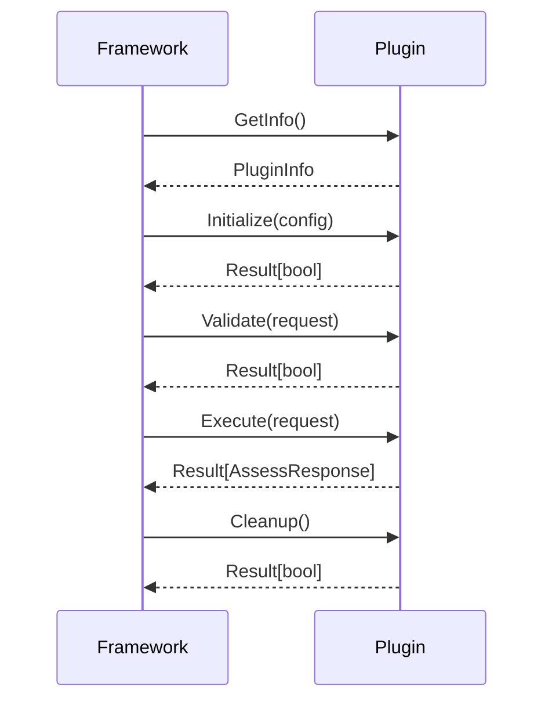

# Plugin Development Guide

This comprehensive guide covers advanced plugin development techniques for the Gibson Plugin SDK.

## Plugin Architecture

### Plugin Lifecycle



### Plugin Types

#### Standard Security Plugin

```go
type MyPlugin struct {
    plugin.BasePlugin
    config Config
    client *http.Client
}
```

#### Streaming Plugin

```go
type MyStreamingPlugin struct {
    *MyPlugin
}

func (p *MyStreamingPlugin) ExecuteStream(ctx context.Context, request models.AssessRequest, resultChan chan<- models.StreamResult) models.Result[bool] {
    defer close(resultChan)

    // Send real-time results
    for result := range p.streamResults(ctx, request) {
        select {
        case resultChan <- result:
        case <-ctx.Done():
            return models.Err[bool](ctx.Err())
        }
    }

    return models.Ok(true)
}
```

#### Batch Plugin

```go
type MyBatchPlugin struct {
    *MyPlugin
}

func (p *MyBatchPlugin) ExecuteBatch(ctx context.Context, requests []models.AssessRequest) models.Result[[]models.AssessResponse] {
    responses := make([]models.AssessResponse, len(requests))

    // Process in parallel
    var wg sync.WaitGroup
    for i, req := range requests {
        wg.Add(1)
        go func(idx int, request models.AssessRequest) {
            defer wg.Done()
            resp := p.Execute(ctx, request)
            if resp.IsOk() {
                responses[idx] = resp.Unwrap()
            }
        }(i, req)
    }
    wg.Wait()

    return models.Ok(responses)
}
```

## Configuration Management

### Plugin Configuration Structure

```go
type PluginConfig struct {
    Timeout      time.Duration          `json:"timeout" validate:"required"`
    MaxRetries   int                    `json:"max_retries" validate:"min=0,max=10"`
    UserAgent    string                 `json:"user_agent"`
    Headers      map[string]string      `json:"headers"`
    RateLimit    string                 `json:"rate_limit" validate:"duration"`
    TLSConfig    *TLSConfig            `json:"tls_config"`
}

type TLSConfig struct {
    InsecureSkipVerify bool     `json:"insecure_skip_verify"`
    CertFile          string   `json:"cert_file"`
    KeyFile           string   `json:"key_file"`
    CAFile            string   `json:"ca_file"`
}
```

### Configuration Validation

```go
import "github.com/zero-day-ai/gibson-sdk/pkg/validation"

func (p *MyPlugin) Initialize(ctx context.Context, config map[string]interface{}) models.Result[bool] {
    var pluginConfig PluginConfig

    // Parse and validate configuration
    if err := validation.MapToStruct(config, &pluginConfig); err != nil {
        return models.Err[bool](fmt.Errorf("invalid configuration: %w", err))
    }

    if err := validation.ValidateStruct(pluginConfig); err != nil {
        return models.Err[bool](fmt.Errorf("configuration validation failed: %w", err))
    }

    p.config = pluginConfig
    p.setupHTTPClient()

    return models.Ok(true)
}
```

## Error Handling Patterns

### Comprehensive Error Handling

```go
func (p *MyPlugin) Execute(ctx context.Context, request models.AssessRequest) models.Result[models.AssessResponse] {
    // Input validation
    if validationResult := p.Validate(ctx, request); validationResult.IsErr() {
        return models.Err[models.AssessResponse](validationResult.Error())
    }

    // Context timeout check
    if ctx.Err() != nil {
        return models.Err[models.AssessResponse](ctx.Err())
    }

    // Perform assessment with retry logic
    findings, err := p.performAssessmentWithRetry(ctx, request)
    if err != nil {
        return models.Err[models.AssessResponse](fmt.Errorf("assessment failed: %w", err))
    }

    response := models.AssessResponse{
        ID:         uuid.New(),
        PluginName: p.GetInfo().Unwrap().Name,
        Status:     "completed",
        StartTime:  time.Now(),
        EndTime:    time.Now(),
        Findings:   findings,
    }

    return models.Ok(response)
}
```

### Retry Logic

```go
func (p *MyPlugin) performAssessmentWithRetry(ctx context.Context, request models.AssessRequest) ([]models.Finding, error) {
    var lastErr error

    for attempt := 0; attempt < p.config.MaxRetries; attempt++ {
        select {
        case <-ctx.Done():
            return nil, ctx.Err()
        default:
        }

        findings, err := p.performAssessment(ctx, request)
        if err == nil {
            return findings, nil
        }

        lastErr = err

        // Exponential backoff
        delay := time.Duration(attempt+1) * time.Second
        time.Sleep(delay)
    }

    return nil, fmt.Errorf("assessment failed after %d attempts: %w", p.config.MaxRetries, lastErr)
}
```

## Performance Optimization

### Connection Pooling

```go
func (p *MyPlugin) setupHTTPClient() {
    transport := &http.Transport{
        MaxIdleConns:        100,
        MaxIdleConnsPerHost: 10,
        IdleConnTimeout:     90 * time.Second,
        TLSClientConfig: &tls.Config{
            InsecureSkipVerify: p.config.TLSConfig.InsecureSkipVerify,
        },
    }

    p.client = &http.Client{
        Transport: transport,
        Timeout:   p.config.Timeout,
    }
}
```

### Rate Limiting

```go
import "golang.org/x/time/rate"

type RateLimitedPlugin struct {
    plugin.BasePlugin
    limiter *rate.Limiter
}

func (p *RateLimitedPlugin) Execute(ctx context.Context, request models.AssessRequest) models.Result[models.AssessResponse] {
    // Wait for rate limiter
    if err := p.limiter.Wait(ctx); err != nil {
        return models.Err[models.AssessResponse](err)
    }

    // Perform assessment
    return p.performAssessment(ctx, request)
}
```

### Caching

```go
import "github.com/patrickmn/go-cache"

type CachedPlugin struct {
    plugin.BasePlugin
    cache *cache.Cache
}

func (p *CachedPlugin) Execute(ctx context.Context, request models.AssessRequest) models.Result[models.AssessResponse] {
    cacheKey := p.generateCacheKey(request)

    // Check cache first
    if cached, found := p.cache.Get(cacheKey); found {
        return models.Ok(cached.(models.AssessResponse))
    }

    // Perform assessment
    result := p.performAssessment(ctx, request)
    if result.IsOk() {
        response := result.Unwrap()
        p.cache.Set(cacheKey, response, 5*time.Minute)
    }

    return result
}
```

## Security Best Practices

### Input Sanitization

```go
import "github.com/zero-day-ai/gibson-sdk/pkg/validation"

func (p *MyPlugin) Validate(ctx context.Context, request models.AssessRequest) models.Result[bool] {
    // URL validation
    if err := validation.ValidateURL(request.Target.URL); err != nil {
        return models.Err[bool](fmt.Errorf("invalid target URL: %w", err))
    }

    // Payload sanitization
    if err := validation.SanitizePayload(&request.Payload); err != nil {
        return models.Err[bool](fmt.Errorf("payload sanitization failed: %w", err))
    }

    // SQL injection prevention
    if validation.ContainsSQLInjection(request.Payload.Content) {
        return models.Err[bool](fmt.Errorf("payload contains potential SQL injection"))
    }

    return models.Ok(true)
}
```

### Secure HTTP Requests

```go
func (p *MyPlugin) createSecureRequest(ctx context.Context, url string, payload []byte) (*http.Request, error) {
    req, err := http.NewRequestWithContext(ctx, "POST", url, bytes.NewBuffer(payload))
    if err != nil {
        return nil, err
    }

    // Security headers
    req.Header.Set("User-Agent", p.config.UserAgent)
    req.Header.Set("Content-Type", "application/json")
    req.Header.Set("X-Request-ID", uuid.New().String())

    // Custom headers from config
    for key, value := range p.config.Headers {
        req.Header.Set(key, value)
    }

    return req, nil
}
```

## Testing Strategies

### Unit Testing

```go
func TestMyPlugin_Execute(t *testing.T) {
    tests := []struct {
        name           string
        request        models.AssessRequest
        expectedStatus string
        expectError    bool
    }{
        {
            name:           "valid request",
            request:        createValidRequest(),
            expectedStatus: "completed",
            expectError:    false,
        },
        {
            name:        "invalid URL",
            request:     createInvalidRequest(),
            expectError: true,
        },
    }

    for _, tt := range tests {
        t.Run(tt.name, func(t *testing.T) {
            plugin := &MyPlugin{}
            plugin.Initialize(context.Background(), getTestConfig())

            result := plugin.Execute(context.Background(), tt.request)

            if tt.expectError {
                assert.True(t, result.IsErr())
            } else {
                assert.True(t, result.IsOk())
                response := result.Unwrap()
                assert.Equal(t, tt.expectedStatus, response.Status)
            }
        })
    }
}
```

### Integration Testing

```go
func TestMyPlugin_Integration(t *testing.T) {
    if testing.Short() {
        t.Skip("Skipping integration test in short mode")
    }

    plugin := &MyPlugin{}
    plugin.Initialize(context.Background(), getTestConfig())

    // Test against real service
    request := models.AssessRequest{
        Target: models.Target{
            URL: "https://httpbin.org/get",
        },
    }

    result := plugin.Execute(context.Background(), request)
    assert.True(t, result.IsOk())

    response := result.Unwrap()
    assert.Equal(t, "completed", response.Status)
    assert.NotEmpty(t, response.ID)
}
```

### Performance Testing

```go
func BenchmarkMyPlugin_Execute(b *testing.B) {
    plugin := &MyPlugin{}
    plugin.Initialize(context.Background(), getTestConfig())

    request := createBenchmarkRequest()

    b.ResetTimer()
    for i := 0; i < b.N; i++ {
        result := plugin.Execute(context.Background(), request)
        if result.IsErr() {
            b.Fatal(result.Error())
        }
    }
}
```

## Advanced Patterns

### Plugin Composition

```go
type CompositePlugin struct {
    plugin.BasePlugin
    plugins []plugin.SecurityPlugin
}

func (p *CompositePlugin) Execute(ctx context.Context, request models.AssessRequest) models.Result[models.AssessResponse] {
    var allFindings []models.Finding

    for _, subPlugin := range p.plugins {
        result := subPlugin.Execute(ctx, request)
        if result.IsOk() {
            response := result.Unwrap()
            allFindings = append(allFindings, response.Findings...)
        }
    }

    response := models.AssessResponse{
        ID:         uuid.New(),
        PluginName: "composite-plugin",
        Status:     "completed",
        StartTime:  time.Now(),
        EndTime:    time.Now(),
        Findings:   allFindings,
    }

    return models.Ok(response)
}
```

### Plugin Middleware

```go
type MiddlewarePlugin struct {
    plugin.SecurityPlugin
    middleware []Middleware
}

type Middleware func(plugin.SecurityPlugin) plugin.SecurityPlugin

func WithLogging(next plugin.SecurityPlugin) plugin.SecurityPlugin {
    return &loggingPlugin{next: next}
}

func WithMetrics(next plugin.SecurityPlugin) plugin.SecurityPlugin {
    return &metricsPlugin{next: next}
}
```

## Deployment Considerations

### Docker Integration

```dockerfile
FROM golang:1.21-alpine AS builder
WORKDIR /app
COPY . .
RUN go build -o plugin main.go

FROM alpine:latest
RUN apk --no-cache add ca-certificates
WORKDIR /root/
COPY --from=builder /app/plugin .
CMD ["./plugin"]
```

### Configuration Management

```yaml
# plugin-config.yaml
plugin:
  timeout: 30s
  max_retries: 3
  rate_limit: 10/s

http:
  user_agent: "MyPlugin/1.0"
  headers:
    X-Plugin-Version: "1.0.0"

tls:
  insecure_skip_verify: false
  cert_file: "/etc/ssl/certs/plugin.crt"
  key_file: "/etc/ssl/private/plugin.key"
```

## Monitoring and Observability

### Metrics Collection

```go
import "github.com/prometheus/client_golang/prometheus"

var (
    assessmentDuration = prometheus.NewHistogramVec(
        prometheus.HistogramOpts{
            Name: "plugin_assessment_duration_seconds",
            Help: "Time spent on assessments",
        },
        []string{"plugin_name", "target_type"},
    )

    findingsTotal = prometheus.NewCounterVec(
        prometheus.CounterOpts{
            Name: "plugin_findings_total",
            Help: "Total number of findings",
        },
        []string{"plugin_name", "severity"},
    )
)

func (p *MyPlugin) Execute(ctx context.Context, request models.AssessRequest) models.Result[models.AssessResponse] {
    timer := prometheus.NewTimer(assessmentDuration.WithLabelValues(p.name, "web"))
    defer timer.ObserveDuration()

    // Perform assessment
    result := p.performAssessment(ctx, request)

    if result.IsOk() {
        response := result.Unwrap()
        for _, finding := range response.Findings {
            findingsTotal.WithLabelValues(p.name, string(finding.Severity)).Inc()
        }
    }

    return result
}
```

### Structured Logging

```go
import "log/slog"

func (p *MyPlugin) Execute(ctx context.Context, request models.AssessRequest) models.Result[models.AssessResponse] {
    logger := slog.With(
        "plugin", p.name,
        "target", request.Target.URL,
        "request_id", request.ID,
    )

    logger.Info("Starting assessment")

    result := p.performAssessment(ctx, request)

    if result.IsOk() {
        response := result.Unwrap()
        logger.Info("Assessment completed",
            "findings", len(response.Findings),
            "duration", response.EndTime.Sub(response.StartTime),
        )
    } else {
        logger.Error("Assessment failed", "error", result.Error())
    }

    return result
}
```

## Resources

- [API Reference](../API.md)
- [Testing Guide](testing.md)
- [Performance Guide](performance.md)
- [Security Guide](security.md)
- [Examples](../../examples/)

## Next Steps

1. Implement advanced plugin features
2. Add comprehensive testing
3. Optimize for performance
4. Deploy with monitoring
5. Contribute back to the community